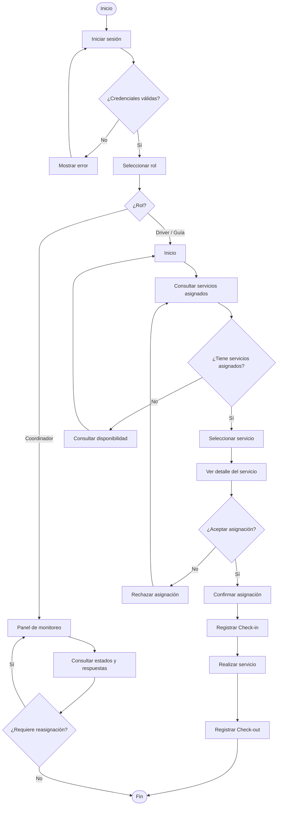
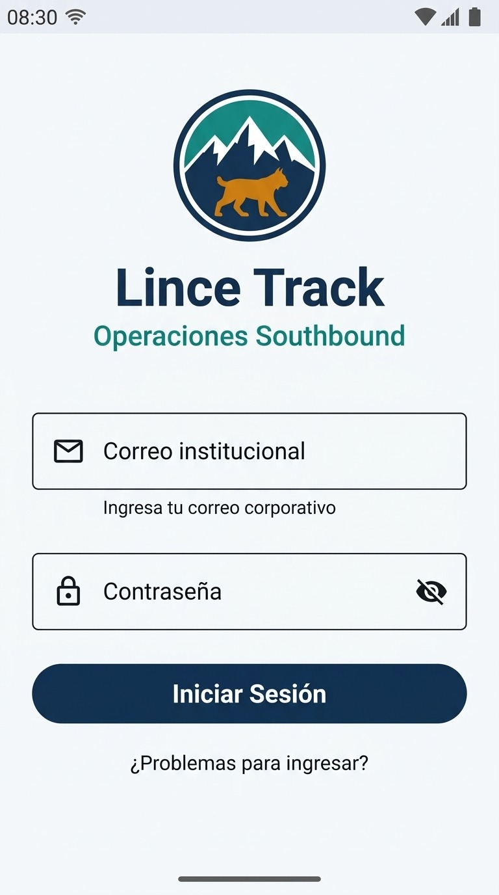
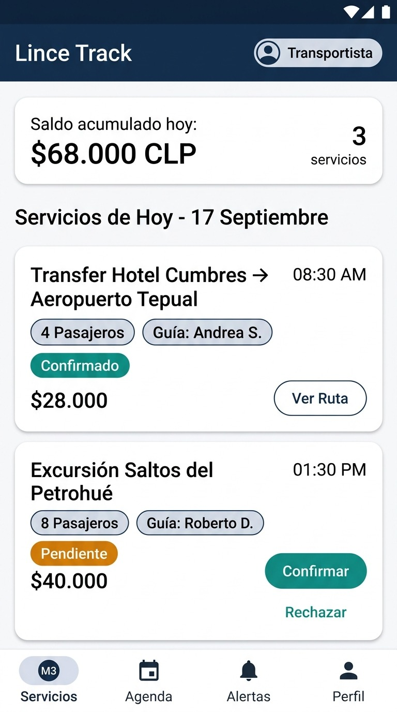
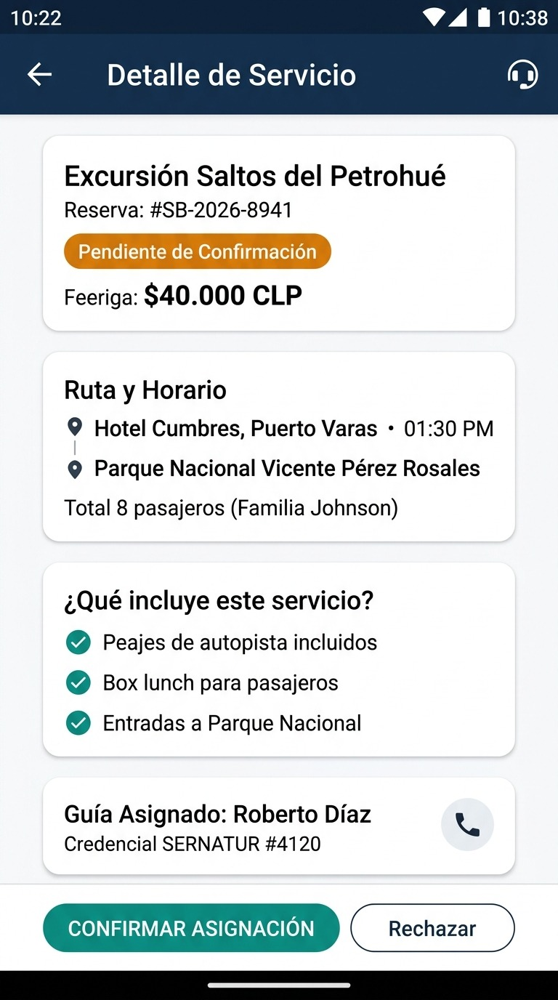
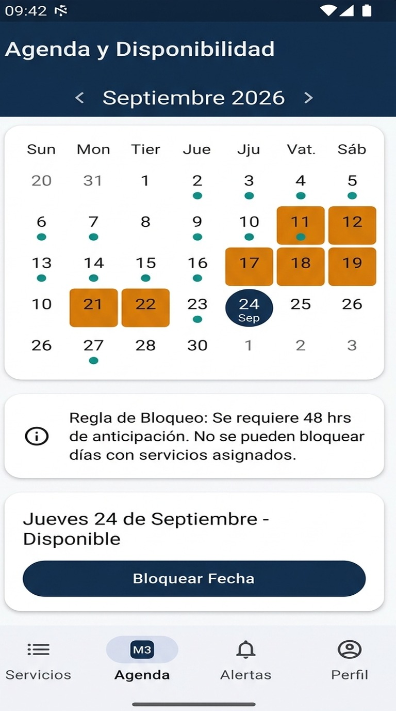
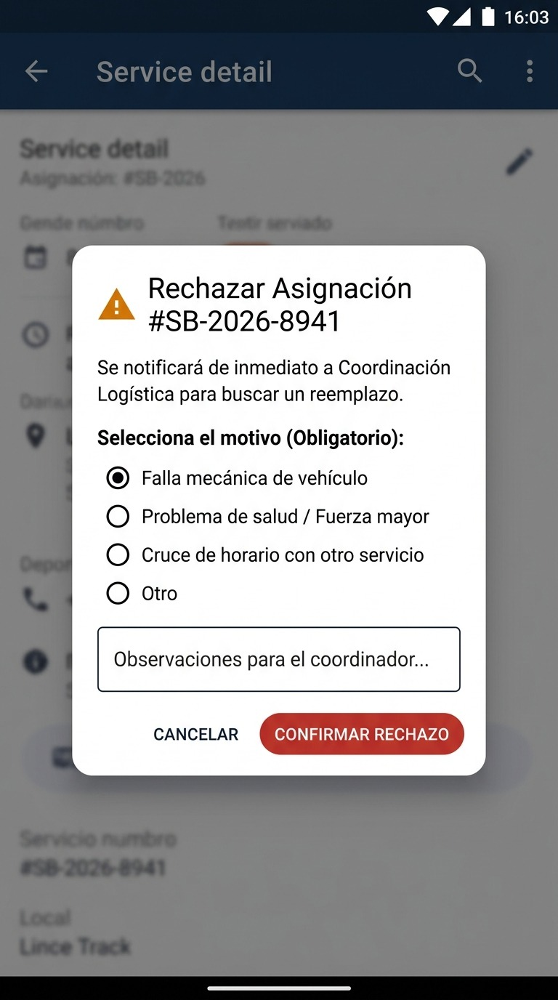
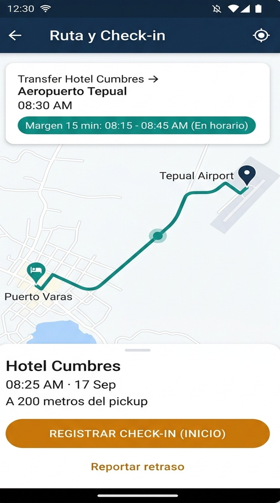
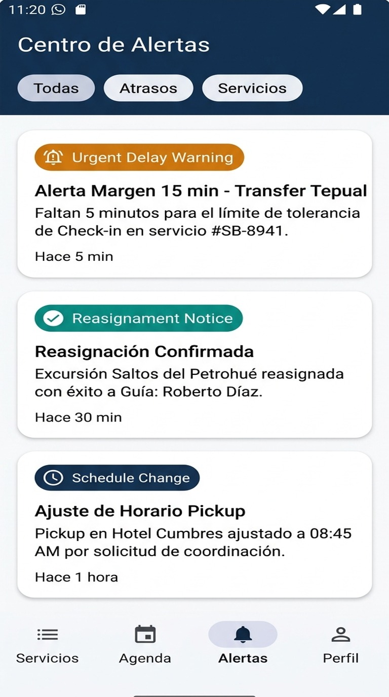
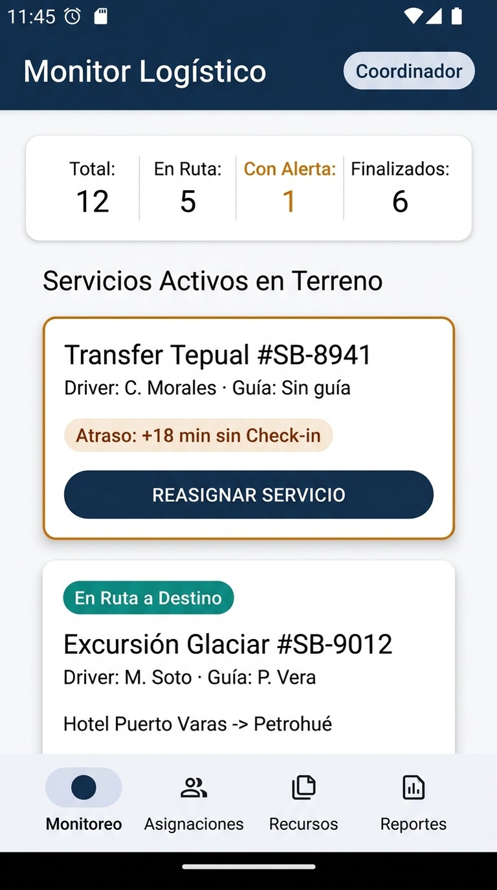

# Lynx Track

## Descripción

**Lynx Track** es una aplicación móvil orientada a mejorar la coordinación de servicios turísticos entre conductores, guías y coordinadores.

El proyecto busca centralizar la información de los servicios asignados, permitiendo consultar servicios, confirmar o rechazar asignaciones,
registrar disponibilidad y realizar el seguimiento del estado de los servicios.

## Identidad visual

### Logo

El logotipo de Lynx Track representa la esencia del proyecto. El lince simboliza agilidad, visión y adaptabilidad,
mientras que las montañas representan el turismo en Chile y la conexión con la naturaleza.

El logo se encuentra en:

```text
docs/diseno/logo.png
```

### Paleta de colores

| Color      | HEX       | Uso                                      |
| ---------- | --------- | ---------------------------------------- |
| Principal  | `#133154` | Botones principales                      |
| Secundario | `#0F8CB3` | Elementos secundarios                    |
| Fondo      | `#FFFFFF` | Fondo general                            |
| Texto      | `#133154` | Textos principales                       |
| Adicional  | `#CF7B0F` | Acentos y estados que requieren atención |

## Flujo de usuario

El siguiente diagrama representa el flujo principal de Lynx Track:



El diagrama UML también se encuentra en:

```text
docs/diseno/flujo-usuario-uml.png
```


## Interfaces principales

Las pantallas definidas para el MVP son las siguientes:

### Login


### Inicio / Servicios asignados


### Detalle del servicio


### Disponibilidad


### Confirmación/Rechazo


### Check-in


### Alertas


### Monitor Logístico


## Integrantes

| Integrante      | Rol          |
|-----------------| ------------ |
| Benjamin Aguero | Frontend     |
| Luciano Garrido | Backend      |
| Raúl Ferrini    | Frontend Dev |
| Ignacio Salazar | Scrum Master |

## Tecnologías

* Android Studio
* Kotlin
* Jetpack Compose
* Material Design 3
* Mermaid

## Evidencia

La evidencia correspondiente a la Clase 2 se encuentra en:

```text
docs/evidencias/Clase02/
```

El documento corresponde a:

```text
Evidencia_Clase_02_Diseno_Lince_Track.docx
```

## Diseño

Los recursos de diseño del proyecto se encuentran en:

```text
docs/diseno/
```

Esta carpeta contiene el logotipo, el diagrama UML y las interfaces de la aplicación.
