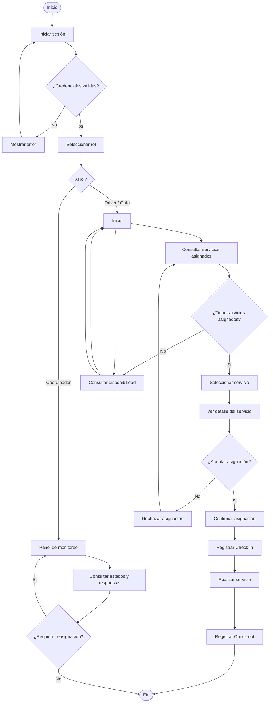

### 2.2 Diagrama UML de actividades

```mermaid
flowchart TD
    A([Inicio]) --> B[Iniciar sesión]
    B --> C{¿Credenciales válidas?}

    C -- No --> D[Mostrar error]
    D --> B

    C -- Sí --> E[Seleccionar rol]
    E --> F{¿Rol?}

    F -- Driver / Guía --> G[Inicio]
    G --> H[Consultar servicios asignados]
    H --> I{¿Tiene servicios asignados?}

    I -- Sí --> J[Seleccionar servicio]
    J --> K[Ver detalle del servicio]
    K --> L{¿Aceptar asignación?}

    L -- Sí --> M[Confirmar asignación]
    M --> N[Registrar Check-in]
    N --> O[Realizar servicio]
    O --> P[Registrar Check-out]
    P --> Q([Fin])

    L -- No --> R[Rechazar asignación]
    R --> H

    I -- No --> S[Consultar disponibilidad]
    S --> G

    G --> S
    S --> G

    F -- Coordinador --> T[Panel de monitoreo]
    T --> U[Consultar estados y respuestas]
    U --> V{¿Requiere reasignación?}

    V -- Sí --> T
    V -- No --> Q
```
